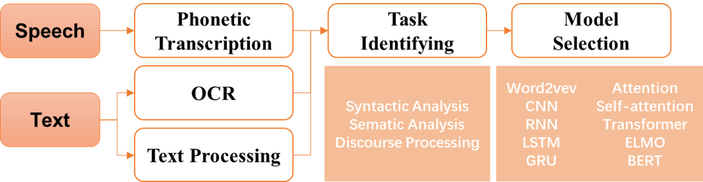

# RGA-NLP-Demo      [*!Still on Working!*]
**Deep Learning for Natural Language Processing**

## Content
+ [**0. Overview**](https://github.com/Junyan-Guo/NLP-Deep-Learning-Demo/tree/master/doc/Overview)
  
  In this section, materials (paper and websites) are contained for better understanding of the following projects.

+ **1. Text Processing**
  - [Processing in Chinese Text](https://github.com/Junyan-Guo/NLP-Deep-Learning-Demo/tree/master/doc/Chinese%20Text%20Processing)
        - [Stop Words](https://github.com/Junyan-Guo/NLP-Deep-Learning-Demo/tree/master/doc/Chinese%20Text%20Processing/stop%20words)
        - [Dataset](https://github.com/Junyan-Guo/NLP-Deep-Learning-Demo/tree/master/doc/Chinese%20Text%20Processing/data)
  - [Processing in English Text](https://github.com/Junyan-Guo/NLP-Deep-Learning-Demo/tree/master/doc/English%20Text%20Processing)

## Application
+ **1. Text Classification**
  - [Movie Reviews (English)](https://github.com/Junyan-Guo/NLP-Deep-Learning-Demo/tree/master/doc/Chinese%20Text%20Processng)
  - [Movie Reviews (Chinese)](https://github.com/Junyan-Guo/NLP-Deep-Learning-Demo/tree/master/doc/Chinese%20Text%20Processng)

+ **2. Sentiment Analysis**

+ **3. Topic Modeling**

+ **4. Name Entitity Recognition**

## General Structure of NLP tasks:

## Datasets
+ **1. Text Classification**

## Key differences between text processing in English and Chinese text data:

  - **Segmentation**: Sophisticated and important to Chinese.
  
    + Chinese
                 
                 "世界你好" -> "世界", "你好"
                 "汉堡好吃" -> "汉堡", "好吃"
    
    + English
                 
                 "Hello World" -> "Hello", "World"
                 "Hamburger is delicious" -> "hamburger", "is", "delicious"  # segementation & transfer to lowercase
    
  - **Lemmatization**: Only for English.
    
    Lemmatization is often used for **Text Minning**, **NLP** for better understanding and analysis of the text.
                 
                   "did", "done", "doing", "does" -> "do"
                   "potatoes" -> "potato"                 
                   "cities" -> "city"                 
                   "children -> "child"
                 
  - **Stemming**:
    
    The word output after stemming may be meaningless.
    
    Stemming is often used for **Information Retrieval**.
                 
                   "hourse" -> "hors"
                   "writing" -> "write" / "writ"
